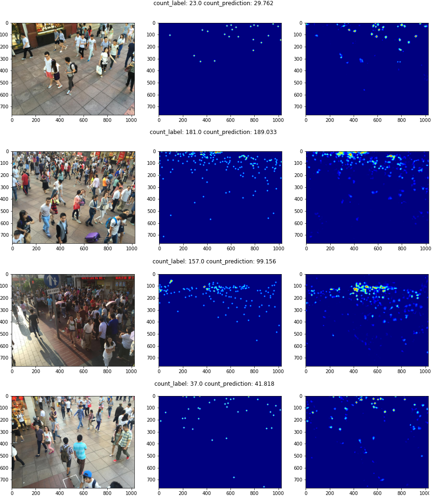

# Data preprocessing and augmentation framework for crowd counting with convolutional neural network

Repository with code relevant to the engineering thesis "Data preprocessing and augmentation framework for crowd counting with convolutional neural network" realized at Gdansk University of Technology, Faculty of Electronics, Telecommunications and Informatics.

Implementation of crowd counting models is based on [C^3 Framework](https://github.com/gjy3035/C-3-Framework).

This repository is an experiment environment for [CCAugmentation Framework](https://github.com/pijuszczyk/CCAugmentation).

## Preparation
- Prerequisites
  - Python 3.x
  - Pytorch 1.x: http://pytorch.org
  - ccaugmentation==0.1.0
  - other required libraries are listed in ```requirements.txt```
- Data
  - We use 90/10 split for test/validation set
  - In order to replicated it please run `./train_val_split/train_val_split.ipynb`
- Paths
  - Please make the following changes:
    - in `./*/load_data.py`: change path `cca.examples.loading.SHHLoader("/dataset/ShanghaiTech_0.1", "train", "B")` to point to your training set; `cca.examples.loading.SHHLoader("/dataset/ShanghaiTech_0.1", "test", "B")` to point to your validation set
    - in `./*/vis-*.ipynb`: `cca.examples.loading.SHHLoader("/dataset/ShanghaiTech", "test", "B")` to point to your test set

## Reproduction
 
To reproduce our results please apply settings specified in `./best-profiles`. You can also use trained weights, which are placed in the same location.

## Results

We obtained the following results on ShanghaiTech part B dataset. To reproduce it please apply settings `./best-profiles/`.

|         |                                    | MAE   | RMSE  |
|---------|------------------------------------|-------|-------|
|   MCNN  | Original paper                     |  26.4 |  41.3 |
|         | C3 implementation                  |  21.5 |  38.1 |
|         | CCAugmentation (ours)              | 15.34 | 24.28 |
|  CSRNet | Original paper                     |  10.6 |  16.6 |
|         | C3 implementation                  |  10.6 |    16 |
|         | CCAugmentation (ours)              | 10.38 | 16.56 |
| C3F-VGG | Original paper / C3 implementation |  10.6 |  16.6 |
|         | CCAugmentation (ours)              |  9.32 | 14.23 |
|  SANet  | Original paper                     |   8.4 |  13.6 |
|         | C3 implementation                  |  12.1 |  19.2 |
|         | CCAugmentation (ours)              | 16.32 | 25.56 |

## CCAugmentation

You can construct various data augmentation pipelines, by modifying ```loading_data()``` function in ```load_data.py```.

See the example below.

```
def loading_data():
    train_pipeline = cca.Pipeline(
        cca.examples.loading.SHHLoader("/dataset/ShanghaiTech_0.1", "train", "B"),
        [
            ccat.Normalize("range_0_to_1"),
            ccat.Normalize("featurewise_centering", by_channel=True, means=[0.43153972, 0.44694245, 0.45164492]),
            ccat.Normalize("featurewise_std_normalization", by_channel=True, stds=[0.22612214, 0.22956612, 0.23729746]),
            
            cca.operations.Duplicate(2), ccat.FlipLR(),   
        ]
    ).execute_generate()
    train_loader = DataLoader(CustomDataset(train_pipeline), batch_size=cfg_data.TRAIN_BATCH_SIZE, num_workers=1, drop_last=True)

    val_pipeline = cca.Pipeline(
        cca.examples.loading.SHHLoader("/dataset/ShanghaiTech_0.1", "test", "B"),
        [
            ccat.Normalize("range_0_to_1"),
            ccat.Normalize("featurewise_centering", by_channel=True, means=[0.43153972, 0.44694245, 0.45164492]),
            ccat.Normalize("featurewise_std_normalization", by_channel=True, stds=[0.22612214, 0.22956612, 0.23729746]),
        ]
    ).execute_generate()
    val_loader = DataLoader(CustomDataset(val_pipeline), batch_size=cfg_data.VAL_BATCH_SIZE, num_workers=1, drop_last=False)
    
    return train_loader, val_loader, lambda x: x
```

For further information about possible data augmentation operation please see [CCAugmentation Framework](https://github.com/pijuszczyk/CCAugmentation).

## Example predictions

Below we present an example prediction for the MCNN model.



## Citation

```
@inproceedings{ccaugmentation,
  title={Data preprocessing and augmentation framework for crowd counting with convolutional neural network},
  author={Konopka, Marcin and Juszczyk, Piotr},
  year={2020}
}
```
```
@article{gao2019c,
  title={C$^3$ Framework: An Open-source PyTorch Code for Crowd Counting},
  author={Gao, Junyu and Lin, Wei and Zhao, Bin and Wang, Dong and Gao, Chenyu and Wen, Jun},
  journal={arXiv preprint arXiv:1907.02724},
  year={2019}
}
```
