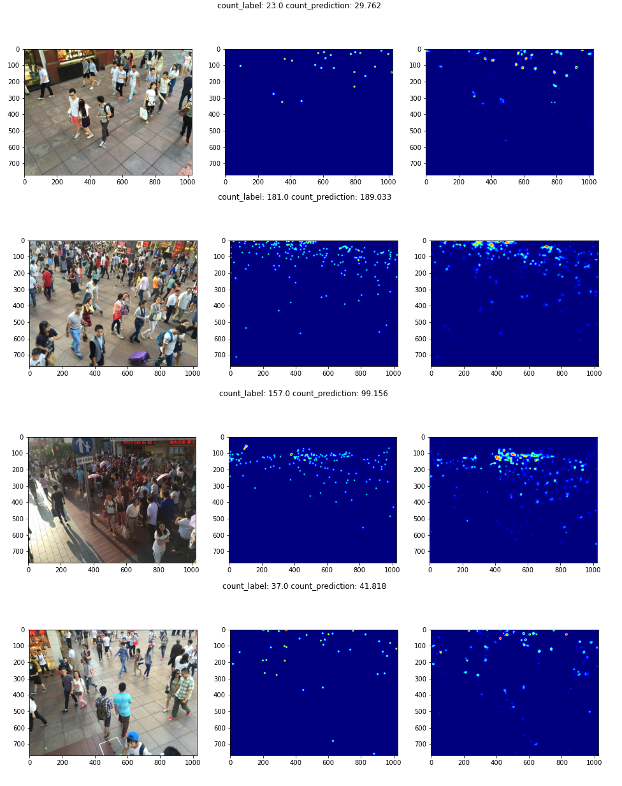

# Data preprocessing and augmentation framework for crowd counting with convolutional neural network

Repository with code relevant to the engineering thesis realized at Gdansk University of Technology.

Implementation of crowd counting models is based on [C^3 Framework](https://github.com/gjy3035/C-3-Framework).

The repository is an experiment environment for [CCAugmentation Framework](https://github.com/pijuszczyk/CCAugmentation).

## Preparation
- Prerequisites
  - Python 3.x
  - Pytorch 1.x: http://pytorch.org
  - ccaugmentation==0.1.0
  - other required libraries are listed in ```requirements.txt```
- Data & paths
  - We use 90/10 split for test/validation set
  - In order to replicated it please run `./train_val_split/train_val_split.ipynb`
  - Please make the following changes:
    - in `./*/load_data.py`: path `cca.examples.loading.SHHLoader("/dataset/ShanghaiTech_0.1", "train", "B")` to point to your training set; `cca.examples.loading.SHHLoader("/dataset/ShanghaiTech_0.1", "test", "B")` to point to your validation set
    - in `./*/vis-*.ipynb`: `cca.examples.loading.SHHLoader("/dataset/ShanghaiTech", "test", "B")` to point to your test set

## Reproduction
 
To reproduce our results please apply settings specified in `./best-profiles`. You can also apply trained weights, which are placed in the same localization.

## Results

We obtained the following results on ShanghaiTech part B dataset. To reproduce it please apply settings `./best-profiles/`.

|         |                                    | MAE   | RMSE  |
|---------|------------------------------------|-------|-------|
|   MCNN  | Original paper                     |  26.4 |  41.3 |
|         | C3 implementation                  |  21.5 |  38.1 |
|         | CCAugmentation (ours)              | 15.34 | 24.28 |
|  CSRNet | Original paper                     |  10.6 |  16.6 |
|         | C3 implementation                  |  10.6 |    16 |
|         | CCAugmentation (ours)              | 10.38 | 16.56 |
| C3F-VGG | Original paper / C3 implementation |  10.6 |  16.6 |
|         | CCAugmentation (ours)              |  9.32 | 14.23 |
|  SANet  | Original paper                     |   8.4 |  13.6 |
|         | C3 implementation                  |  12.1 |  19.2 |
|         | CCAugmentation (ours)              | 16.32 | 25.56 |

## Example predictions

Below we present an example prediction for the CSRNet model.



## Citation

```
@inproceedings{ccaugmentation,
  title={Data preprocessing and augmentation framework for crowd counting with convolutional neural network},
  author={Konopka, Marcin and Juszczyk, Piotr},
  year={2020}
}
```
```
@article{gao2019c,
  title={C$^3$ Framework: An Open-source PyTorch Code for Crowd Counting},
  author={Gao, Junyu and Lin, Wei and Zhao, Bin and Wang, Dong and Gao, Chenyu and Wen, Jun},
  journal={arXiv preprint arXiv:1907.02724},
  year={2019}
}
```
